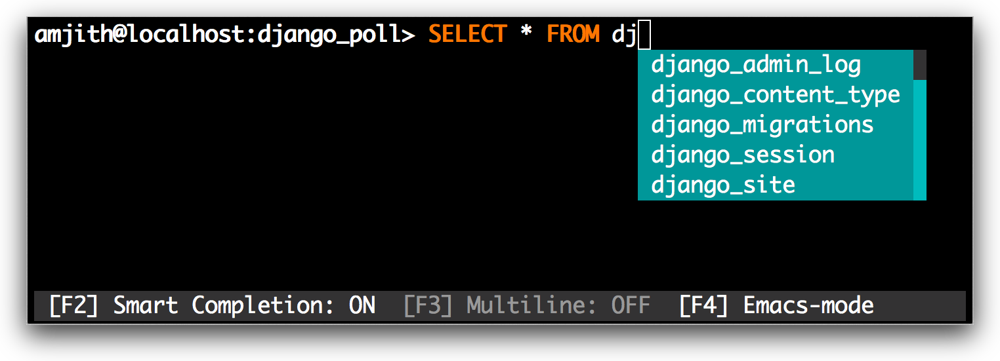

# The mycli snap

A command line client for MySQL that can do auto-completion and syntax highlighting.

<p align="center"><b>This is the snap for <a href="https://www.mycli.net/">mycli</a>.</b> It works on Ubuntu, Fedora, Debian, and other major Linux
distributions.</p>


<p align="center">Published for  with :gift_heart: by Khiem Doan</p>

HomePage: [http://mycli.net](http://mycli.net)  
Documentation: [http://mycli.net/docs](http://mycli.net/docs)




Quick Start
-----------

```
$ sudo snap install mycli
```

### Usage

    $ mycli --help
    Usage: mycli [OPTIONS] [DATABASE]

      A MySQL terminal client with auto-completion and syntax highlighting.

      Examples:
        - mycli my_database
        - mycli -u my_user -h my_host.com my_database
        - mycli mysql://my_user@my_host.com:3306/my_database

    Options:
      -h, --host TEXT               Host address of the database.
      -P, --port INTEGER            Port number to use for connection. Honors
                                    $MYSQL_TCP_PORT.
      -u, --user TEXT               User name to connect to the database.
      -S, --socket TEXT             The socket file to use for connection.
      -p, --password TEXT           Password to connect to the database.
      --pass TEXT                   Password to connect to the database.
      --ssh-user TEXT               User name to connect to ssh server.
      --ssh-host TEXT               Host name to connect to ssh server.
      --ssh-port INTEGER            Port to connect to ssh server.
      --ssh-password TEXT           Password to connect to ssh server.
      --ssh-key-filename TEXT       Private key filename (identify file) for the
                                    ssh connection.
      --ssl-ca PATH                 CA file in PEM format.
      --ssl-capath TEXT             CA directory.
      --ssl-cert PATH               X509 cert in PEM format.
      --ssl-key PATH                X509 key in PEM format.
      --ssl-cipher TEXT             SSL cipher to use.
      --ssl-verify-server-cert      Verify server's "Common Name" in its cert
                                    against hostname used when connecting. This
                                    option is disabled by default.
      -V, --version                 Output mycli's version.
      -v, --verbose                 Verbose output.
      -D, --database TEXT           Database to use.
      -d, --dsn TEXT                Use DSN configured into the [alias_dsn]
                                    section of myclirc file.
      --list-dsn                    list of DSN configured into the [alias_dsn]
                                    section of myclirc file.
      -R, --prompt TEXT             Prompt format (Default: "\t \u@\h:\d> ").
      -l, --logfile FILENAME        Log every query and its results to a file.
      --defaults-group-suffix TEXT  Read MySQL config groups with the specified
                                    suffix.
      --defaults-file PATH          Only read MySQL options from the given file.
      --myclirc PATH                Location of myclirc file.
      --auto-vertical-output        Automatically switch to vertical output mode
                                    if the result is wider than the terminal
                                    width.
      -t, --table                   Display batch output in table format.
      --csv                         Display batch output in CSV format.
      --warn / --no-warn            Warn before running a destructive query.
      --local-infile BOOLEAN        Enable/disable LOAD DATA LOCAL INFILE.
      --login-path TEXT             Read this path from the login file.
      -e, --execute TEXT            Execute command and quit.
      --help                        Show this message and exit.

Features
--------

`mycli` is written using [prompt_toolkit](https://github.com/jonathanslenders/python-prompt-toolkit/).

* Auto-completion as you type for SQL keywords as well as tables, views and
  columns in the database.
* Syntax highlighting using Pygments.
* Smart-completion (enabled by default) will suggest context-sensitive completion.
    - `SELECT * FROM <tab>` will only show table names.
    - `SELECT * FROM users WHERE <tab>` will only show column names.
* Support for multiline queries.
* Favorite queries with optional positional parameters. Save a query using
  `\fs alias query` and execute it with `\f alias` whenever you need.
* Timing of sql statments and table rendering.
* Config file is automatically created at ``~/.myclirc`` at first launch.
* Log every query and its results to a file (disabled by default).
* Pretty prints tabular data (with colors!)
* Support for SSL connections

Configuration and Usage
-----------------------

For more information on using and configuring mycli, [check out documentation](http://mycli.net/docs).

Common topics include:
- [Configuring mycli](http://mycli.net/config)
- [Using/Disabling the pager](http://mycli.net/pager)
- [Syntax colors](http://mycli.net/syntax)